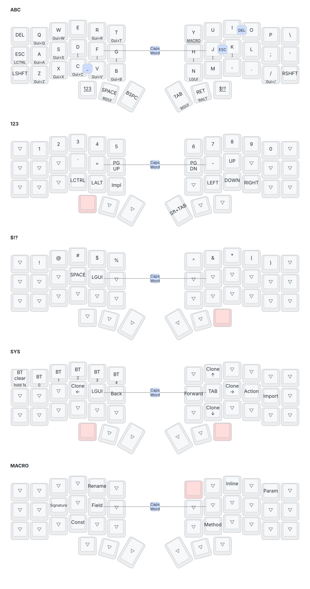

# Corne keymap

ZMK config for a Corne on nice!nano v2 with nice!view displays. Firmware is built by
GitHub Actions on every push; grab the `firmware` artifact from the latest run and flash
left, then right.

The picture below is generated from `config/corne.keymap` by
[keymap-drawer](https://github.com/caksoylar/keymap-drawer) on every push that touches
the keymap, so it is always current.

## Layout notes

- Home row holds: `A S Z X C V B Q W R T` send Cmd + letter, `D F G H J K` send brackets.
- Thumbs: Numbers / Space (Cmd) / Backspace and Tab (Cmd) / Enter (Alt) / Symbols.
  Holding Numbers and Symbols together gives the System layer. Holding `Y` gives the Macro layer.
- Combos: `J`+`K` Escape, `F`+`J` Caps Word, `I`+`O` Delete, `C`+`V` underscore.
- The Macro layer drives IntelliJ refactorings through the Meh (Ctrl+Alt+Shift) chords.
